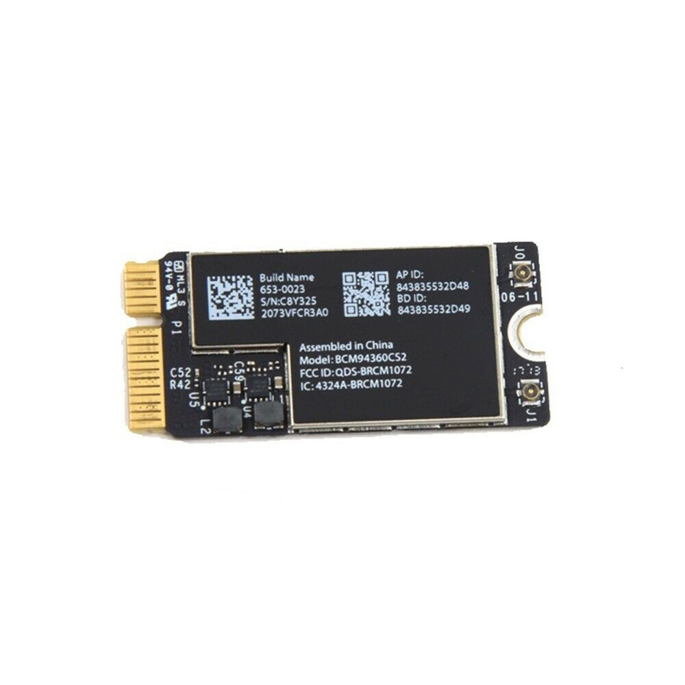
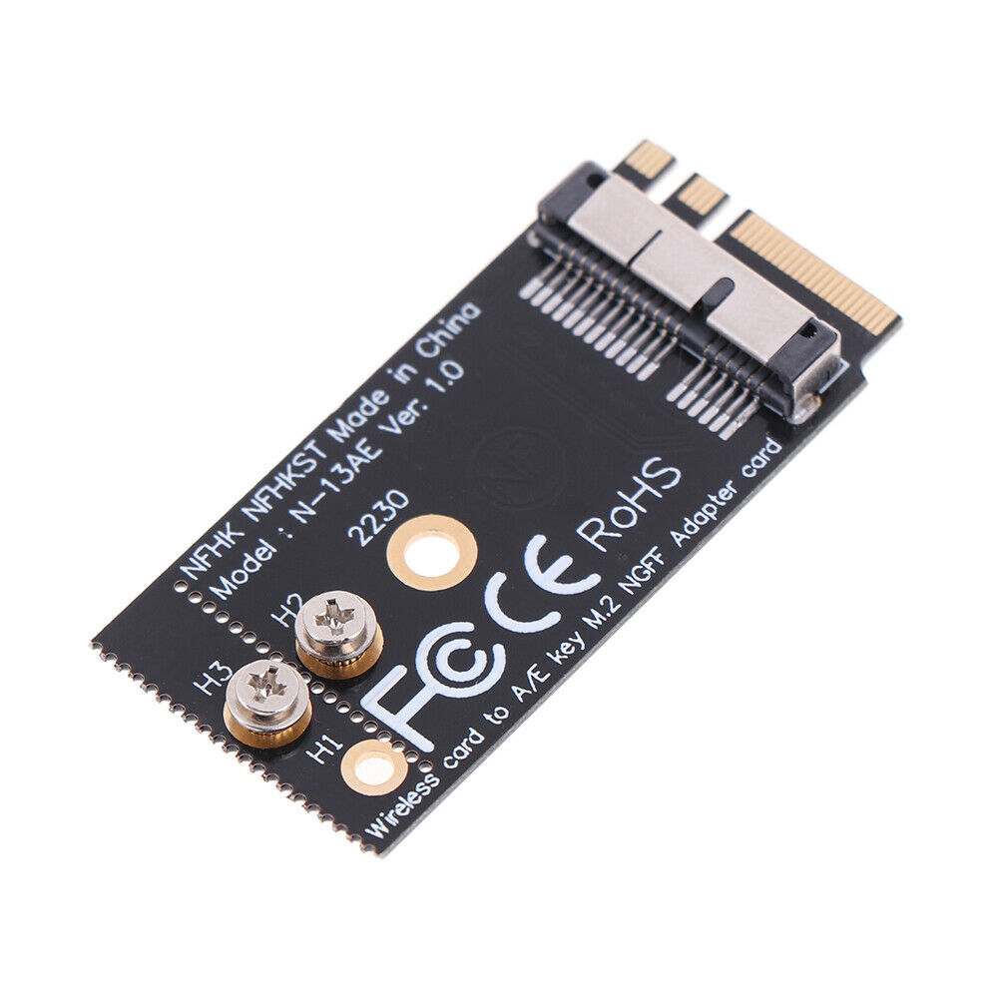
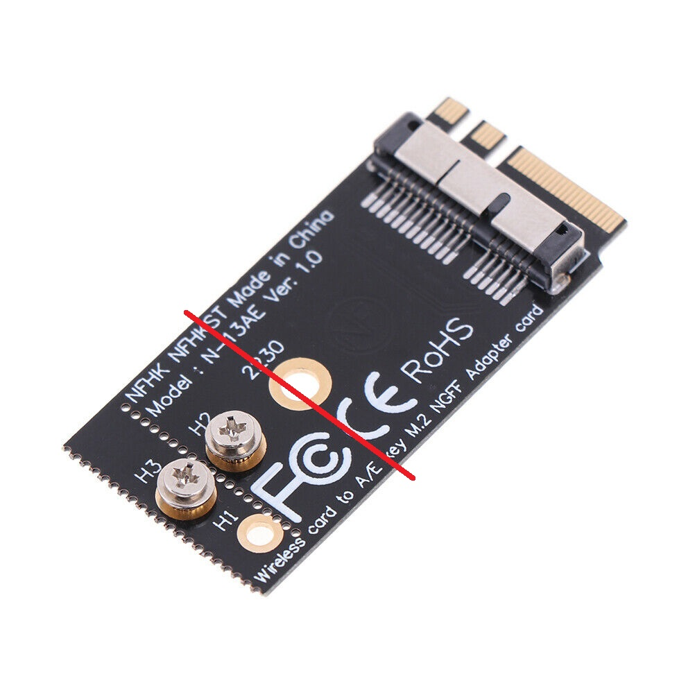

# hp-elitebook840-g3-hackintosh
Needed Files for a running HP Elitebook 840 G3 based Hackintosh

Mainly based on
https://github.com/Hologos/hackintosh-hp-elitebook-840-g3
Thanks a lot to him! Mostly his guide and files worked for me, only a few others where required to replace/add. 

# EFI
Inside the EFI folder my configuration and kexts. You need to create your own serialnumber and boardserialnumber in SMBIOS section in config.plist!

# Hardware changes
I exchanged the original Intel WiFi card to a used Apple Airport Express WiFi5 (AC) / Bluetooth 4 card A1466 (Apple part number: Apple part number : 661-7481). The antenna connectors will fit. It is a long card, but with the adapter below it fits inside the Elitebook. No additional driver (kext) needed, runs ootb. I can use Airdrop and Airplay screen mirroring/extension.

A NGFF M.2 Adapter is needed to fit the card in the socket. I used these search terms: "BCM94360CS2 BCM943224PCIEBT2 12 + 6-poliges WLAN-Kartenmodul NGFF M.2 B9CRH" and bought it on 3bay

Cut the adapter like this:

You can use the original screw to fix the adapter inside the Elitebook socket. After mounting protect the metal screw and surrounding parts at the mainboard with electric tape to prevent shortage. Now install the Airport card and connect the antenna cables.
To get the Bluetooth and WiFi card working, check BIOS Settings in Elitebook. In section "Build-in components" enable Bluetooth and WiFi. This put Pin 54 and 56 of the socket to low means enabling the Airport card.
